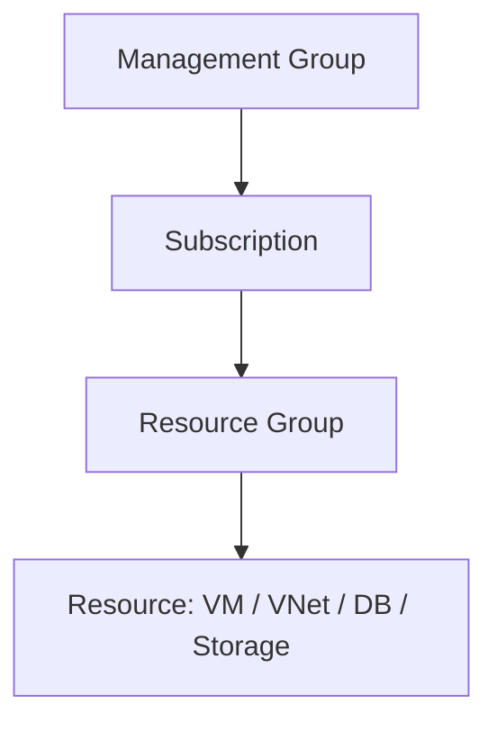

# 🏗️ Componentes de Arquitetura do Azure - AZ-900

Este repositório reúne anotações e revisões sobre os **principais componentes de arquitetura do Microsoft Azure**, abordados no exame **AZ-900 (Microsoft Azure Fundamentals)**.  
O objetivo é consolidar o aprendizado e servir como guia de consulta rápida.

---

## 🌍 Regiões do Azure
- O **Azure** está distribuído em **regiões geográficas** no mundo todo.  
- Cada região é composta por **um ou mais datacenters** interconectados.  
- Existem:
  - **Regiões padrão** → disponíveis globalmente.  
  - **Pares de regiões** → duas regiões dentro da mesma área geográfica, oferecendo redundância.  
  - **Regiões soberanas** → dedicadas a requisitos governamentais específicos (ex.: Azure China, Azure Government nos EUA).  

---

## 🏢 Zonas de Disponibilidade
- As **Zonas de Disponibilidade** são **datacenters fisicamente separados** dentro de uma mesma região.  
- Garantem alta disponibilidade, pois se um datacenter falhar, outro da mesma região continua operando.  
- Cada zona tem **infraestrutura independente** (energia, resfriamento e rede).  
- Ao usar zonas, você obtém **resiliência contra falhas locais**.  

---

## 📦 Recursos e Grupos de Recursos
- **Recurso (Resource):** qualquer item utilizável no Azure (VM, banco de dados, rede virtual, etc).  
- **Grupo de Recursos (Resource Group):** container lógico que organiza e gerencia recursos relacionados.  

👉 Vantagem: todos os recursos dentro de um grupo podem ser **implantados, monitorados e excluídos juntos**.

---

## 🧾 Assinaturas e Grupos de Gerenciamento
- **Assinatura (Subscription):** unidade de faturamento e controle de acesso.  
- **Grupos de Gerenciamento (Management Groups):** camada acima das assinaturas para organizar várias subscrições de uma organização.  

**Hierarquia:**

---

## 🛠️ Prática Realizada
Durante os estudos, foi realizado:  
1. **Criação de um Grupo de Recursos**.  
2. **Criação de uma Rede Virtual (VNet)**.  
3. **Associação da VNet ao Grupo de Recursos**.  
4. Exploração das **configurações do grupo** pelo Portal do Azure.  

---

## 📌 Revisão Rápida
- ✅ Regiões, pares de regiões e regiões soberanas do Azure.  
- ✅ Zonas de disponibilidade e datacenters.  
- ✅ Recursos e grupos de recursos.  
- ✅ Assinaturas e grupos de gerenciamento.  
- ✅ Hierarquia entre grupos de recursos, assinaturas e grupos de gerenciamento.  
- ✅ Criação de grupo de recursos e rede virtual no portal do Azure.  

---

## 🎯 Conclusão
Entender os **componentes de arquitetura do Azure** é essencial para dominar os fundamentos de nuvem.  
Compreender a organização em **regiões, zonas, recursos, grupos, assinaturas e grupos de gerenciamento** facilita a administração, aumenta a resiliência e ajuda a otimizar custos.  

Este conhecimento é a base para avançar em arquiteturas mais complexas e preparar-se para certificações mais avançadas.

---
